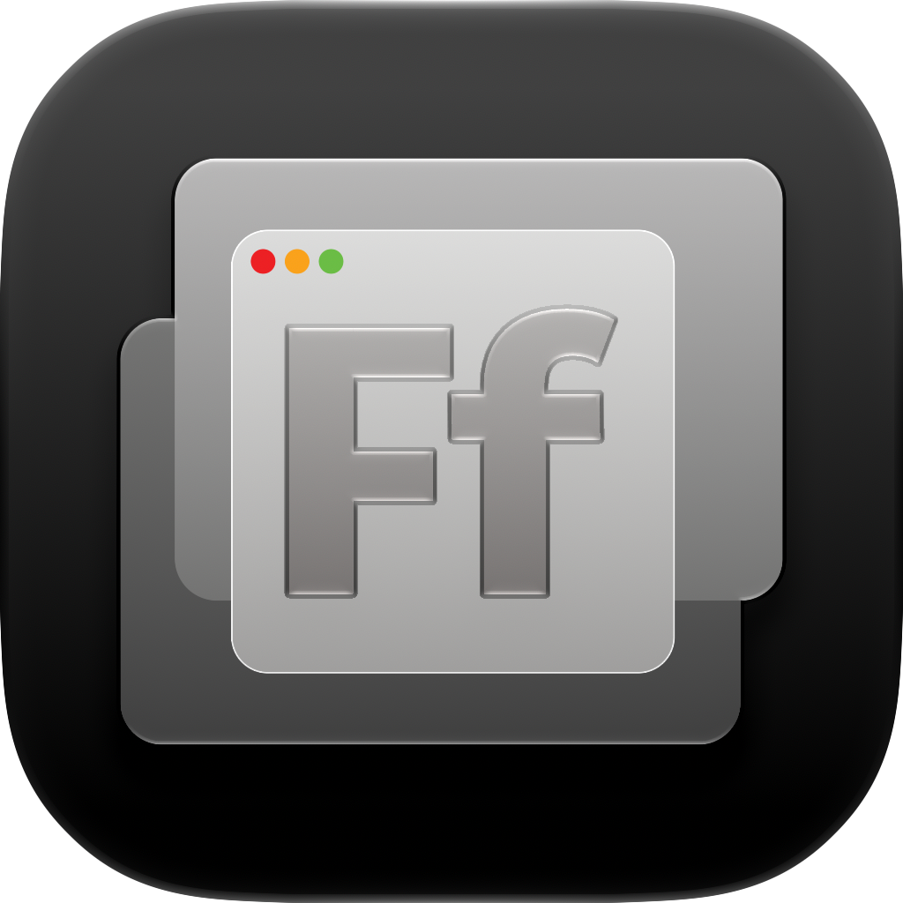

# FocusFocus

<div align="center">



### Elegant Multi-Layer Window Dimmer for macOS

[](https://apple.com/macos)
[](LICENSE)
[](https://swift.org)
[](https://github.com/sponsors/rfdixon)
[](https://apps.apple.com)

</div>

---

**FocusFocus** helps you stay in the flow by gently dimming background and inactive windows on macOS. Unlike simple single-shade dimmers, FocusFocus features an intelligent **multi-layer depth engine** that progressively darkens further windows—creating a natural, distraction-free visual depth hierarchy.

---

## ✨ Features

- ⚡ **Virtually Zero Resource Usage**: Operates silently in the background with ~0% CPU at idle and a featherlight memory footprint. Fully event-driven with zero battery drain on MacBooks.
- 🎯 **Multi-Layer Depth Dimming**: Progressively exaggerates depth by darkening each successive background layer in the window stack.
- 🪟 **Active Window or Entire App**: Choose between dimming all other windows except the frontmost window, or keeping all windows of the active app bright together.
- 🛡️ **Zero-Permission Standard Mode**: Works out of the box with **zero system permissions** required.
- 🚀 **Optional Live Drag Tracking**: Grant Accessibility access only if you want real-time overlay tracking while actively dragging windows.
- 🎨 **Custom Tint Colors**: Use classic dark tint or personalize with warm sepia, dark navy, or any system color hue.
- 🪟 **Fade into Desktop Mode**: Optionally blends deeper background layers smoothly into your desktop wallpaper.
- 🖥️ **Multi-Display & Space Aware**: Seamlessly updates across multiple monitors and macOS Spaces.
- 🎛️ **Sleek Menu Bar Utility**: Zero-clutter status item with live toggle, reactive state icon, and instant preferences.
- 🔒 **100% Offline & Private**: Zero data collection, no telemetry, no network calls, and runs strictly locally on your Mac.

---

## ⚙️ How It Works

1. **Window Hierarchy Tracking**: FocusFocus inspects the on-screen window z-order via macOS `CGWindowListCopyWindowInfo` to determine the depth order of all visible windows.
2. **Multi-Layer NSWindow Overlays**: For each detected layer, FocusFocus manages a non-interactive, borderless `NSWindow` overlay placed precisely between applications in the window stack.
3. **Dual Focus Modes**:
   - **Active Window**: Each window in the z-stack occupies its own depth tier, keeping only the single focused window highlighted.
   - **Entire App**: All windows belonging to the front application share the top tier, placing dimmers behind the entire app.
4. **Smart Notification Monitoring**: FocusFocus listens to workspace activation, deactivation, and space change notifications with a fast 50ms coalesce for instant, battery-friendly response without continuous polling.
5. **Desktop Wallpaper Synchronization**: When *Fade into Desktop* is enabled, `WallpaperManager` caches active desktop images per display and Space, cross-fading deeper layers into the desktop.

---

## 🎛️ Customization

Access settings anytime by clicking the FocusFocus menu bar icon and selecting **Preferences...**:

| Setting | Options / Range | Description |
| :--- | :--- | :--- |
| **Enable Dimming** | On / Off | Instantly toggles dimming overlays. |
| **Focus Scope** | Active Window / Entire App | Focus only the front window or all windows belonging to the active app. |
| **Fade into Desktop** | On / Off | Blends deep layers into your desktop wallpaper rather than a solid tint. |
| **Tint Color** | Color Picker | Custom overlay hue (e.g. warm amber, dark slate, deep black). |
| **Base Darkness** | 0% – 80% | Controls darkness of the immediate background window layer. |
| **Depth Multiplier** | 0% – 30% | Progressive darkness increase applied to each successive layer behind it. |
| **Live Drag Tracking** | Enable (Optional) | Optional Accessibility access to update overlays while actively dragging windows. |

---

## 📥 Installation

### Option 1: Mac App Store
> **Coming Soon** to the Mac App Store for automatic updates and one-click installation.

### Option 2: Build from Source (Free)

FocusFocus is source-available and free for personal use under the [PolyForm Noncommercial License 1.0.0](LICENSE). You can clone and build it locally in seconds:

#### Prerequisites
- macOS 12.0 (Monterey) or later
- Xcode Command Line Tools (`xcode-select --install`)

#### Build Steps
```bash
# 1. Clone the repository
git clone https://github.com/rfdixon/FocusFocus.git
cd FocusFocus

# 2. Build FocusFocus.app
./build.sh

# 3. Launch the app
open FocusFocus.app
```

#### Optional: Move to Applications
```bash
cp -R FocusFocus.app /Applications/
```

---

## 🔐 Permissions & Privacy

FocusFocus is built with user privacy and security at its foundation:

- **Zero Permissions Needed**: FocusFocus runs in Standard Mode out of the box without requiring Accessibility or screen recording permissions.
- **Optional Accessibility Permission**: Used exclusively for *Live Drag Tracking* (`AXObserver` events) to track window boundaries in real time while actively dragging.
- **Zero Content Access**: FocusFocus **never** records, captures, or inspects window contents, keystrokes, or screen pixels.
- **Zero Network Calls**: FocusFocus contains zero analytics SDKs, zero telemetry, and zero outbound network traffic.
- See our [Privacy Policy](PRIVACY.md) for complete details.

### Troubleshooting Permissions
If you reinstall or rebuild with a new signature, macOS may occasionally retain stale Accessibility permission entries. You can reset it via Terminal:
```bash
tccutil reset Accessibility com.robertdixon.FocusFocus
```

---

## 🛠️ Repository Structure

```
FocusFocus/
├── Info.plist                # App bundle configuration & metadata
├── FocusFocus.entitlements   # App entitlements
├── AppIcon.icns              # Multi-resolution macOS application icon
├── build.sh                  # One-step build & code-signing script
├── assets/                   # README banner, vector source, and icon exports
├── src/
│   ├── main.swift            # Entry point & activation policy
│   ├── AppDelegate.swift     # Window layering engine & AXObserver lifecycle
│   ├── DimWindow.swift       # Layer-backed overlay window view
│   ├── MenuController.swift  # Status bar icon & menu controller
│   ├── PreferencesView.swift # SwiftUI preferences interface
│   ├── Settings.swift        # Observable persistent UserDefaults settings
│   └── WallpaperManager.swift# Space-aware desktop wallpaper caching
├── debug/                    # Standalone diagnostic scripts for window inspection
├── LICENSE                   # PolyForm Noncommercial 1.0.0 License
└── PRIVACY.md                # Privacy policy
```

---

## 🤝 Contributing

Contributions, bug reports, and feature suggestions are welcome!
1. Fork the repository
2. Create your feature branch (`git checkout -b feature/amazing-feature`)
3. Commit your changes (`git commit -m 'Add amazing feature'`)
4. Push to the branch (`git push origin feature/amazing-feature`)
5. Open a Pull Request

---

## 💖 Sponsor & Support

If you find FocusFocus helpful and want to support independent macOS development, consider becoming a sponsor:

[](https://github.com/sponsors/rfdixon)

---

## 📄 License

FocusFocus is licensed under the [PolyForm Noncommercial License 1.0.0](LICENSE). Free for personal and non-commercial use. Commercial distribution, resale, or sublicensing is strictly prohibited. Copyright © 2026 Robert Dixon.
